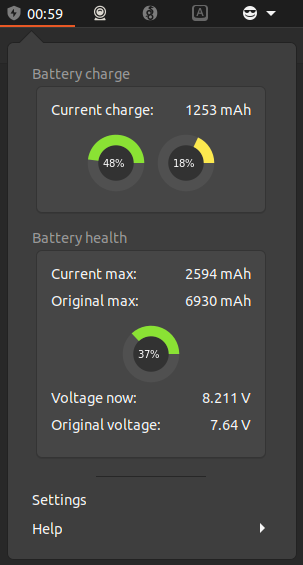
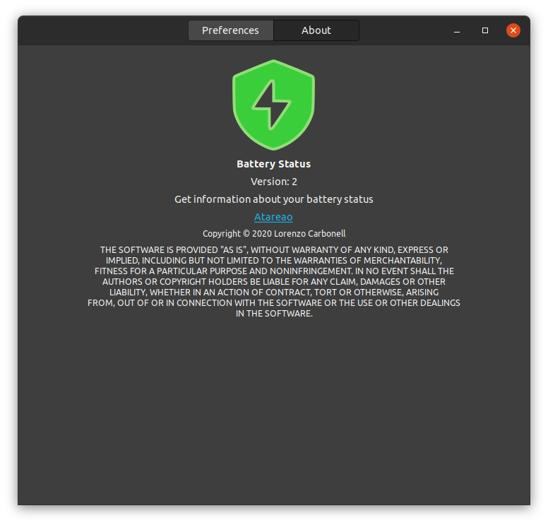

<!-- start project-info -->
<!--
project_title: Battery Status
github_project: https://github.com/atareao/battery-status
license: MIT
icon: /datos/Sync/Programacion/gnome-shell/battery-status@atareao.es/icons/battery-status-icon.svg
homepage: https://www.atareao.es/aplicacion/battery-status
license-badge: True
contributors-badge: True
lastcommit-badge: True
codefactor-badge: True
--->

<!-- end project-info -->

<!-- start badges -->

<!-- end badges -->

<!-- start description -->
<h1 align="center">Welcome to Battery Status 👋</h1>

<h2>🏠 <a href="https://www.atareao.es/aplicacion/battery-status" id="homepage">Homepage</a></h2>

Battery Status is an indicator to show the status of your battery.

<!-- end description -->

<!-- start prerequisites -->
## Prerequisites

You need GNOME Shell
<!-- end prerequisites -->

<!-- start installing -->
## Installing Battery Status

To install Battery Status, follow these steps:

Goto [GNOME Extensions page](https://extensions.gnome.org/) and search for WireGuard Indicator.

Enable the extension by click the switch.

<!-- end installing -->

<!-- start using -->
## Using Battery Status

When you start **Battery Status** it goes to Indicator Area, as you can see in the next screenshot,

There are a lot of options to configure Battery Status

About

<!-- end using -->

<!-- start contributing -->
## Contributing to Battery Status

To contribute to **Battery Status**, follow these steps:

1. Fork this repository.
2. Create a branch: `git checkout -b <branch_name>`.
3. Make your changes and commit them: `git commit -m '<commit_message>'`
4. Push to the original branch: `git push origin atareao/readmemaker`
5. Create the pull request.

Alternatively see the GitHub documentation on [creating a pull request](https://help.github.com/en/github/collaborating-with-issues-and-pull-requests/creating-a-pull-request).
</commit_message></branch_name>

<!-- end contributing -->

<!-- start contributors -->
## 👤 Contributors ✨

Thanks goes to these wonderful people ([emoji key](https://allcontributors.org/docs/en/emoji-key)):

<!-- end contributors -->

<!-- start table-contributors -->

<table id="contributors">
	<tr id="info_avatar">
		<td id="atareao" align="center">
			
		</td>
	</tr>
	<tr id="info_name">
		<td id="atareao" align="center">
			<a href="https://github.com/atareao">
				<strong>Lorenzo Carbonell</strong>
			</a>
		</td>
	</tr>
	<tr id="info_commit">
		<td id="atareao" align="center">
			<a href="/commits?author=atareao">
				💻
			</a>
		</td>
	</tr>
</table>
<!-- end table-contributors -->
